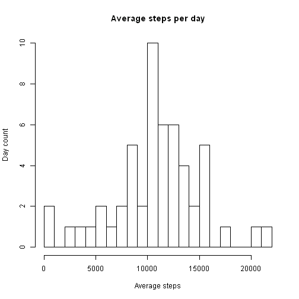
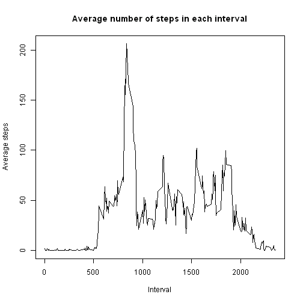
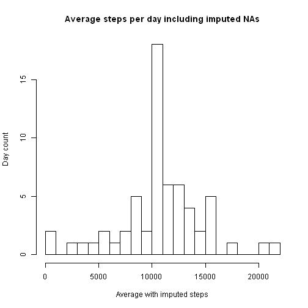
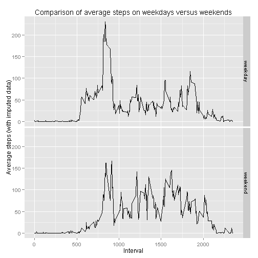

# Reproducible Research: Peer Assessment 1


## Loading and preprocessing the data

The data for this assignment can be downloaded from the course web site:

https://d396qusza40orc.cloudfront.net/repdata%2Fdata%2Factivity.zip [52K]  
The variables included in this dataset are:  

steps: Number of steps taking in a 5-minute interval (missing values are coded as NA)  

date: The date on which the measurement was taken in YYYY-MM-DD format  

interval: Identifier for the 5-minute interval in which measurement was taken  

The dataset is stored in a comma-separated-value (CSV) file and there are a total of 17,568 observations in this dataset.  

The Github repository for this assignment was first forked into my GitHub repositroy from https://github.com/rdpeng/RepData_PeerAssessment1, with  the SHA-1 commit of dc20c7c4e92aea6af318a611e2669d5b9c6cbfaf.    

I then cloned it to my R working directory using GitBash MINGW32.  

First read in the (zipped) activity.csv file from working directory, then unzip it, calling it activityRaw.  Then check the data base structure:

```r
unzip("activity.zip")
activityRaw=read.csv("activity.csv")
str(activityRaw)
```

```
## 'data.frame':	17568 obs. of  3 variables:
##  $ steps   : int  NA NA NA NA NA NA NA NA NA NA ...
##  $ date    : Factor w/ 61 levels "2012-10-01","2012-10-02",..: 1 1 1 1 1 1 1 1 1 1 ...
##  $ interval: int  0 5 10 15 20 25 30 35 40 45 ...
```
Next, transform the date column from a factor to date format, and use this to create a new variable called "day" that will give us the date as a weekday (Monday through Sunday):

```r
activityRaw$date=as.Date(activityRaw$date)
day=weekdays(activityRaw$date)
activityRaw$day=day
```
Finally, create a fifth variable called "weektime" that classifies the day as weekday or weekend:

```r
activityRaw$weektime <- as.factor(ifelse(activityRaw$day %in% c("Saturday","Sunday"),"weekend", "weekday"))
```
Check the structure again:

```r
str(activityRaw)
```

```
## 'data.frame':	17568 obs. of  5 variables:
##  $ steps   : int  NA NA NA NA NA NA NA NA NA NA ...
##  $ date    : Date, format: "2012-10-01" "2012-10-01" ...
##  $ interval: int  0 5 10 15 20 25 30 35 40 45 ...
##  $ day     : chr  "Monday" "Monday" "Monday" "Monday" ...
##  $ weektime: Factor w/ 2 levels "weekday","weekend": 1 1 1 1 1 1 1 1 1 1 ...
```


## What is mean total number of steps taken per day?

1.Make a histogram of the total number of steps taken each day

To plot this, first aggregate the data to sum the steps for each day:

```r
perDay=aggregate(steps~date, data=activityRaw, sum)
```

Now plot the data:

```r
hist(perDay$steps, breaks=20, main= "Average steps per day", xlab="Average steps", ylab="Day count")
```

 

2.Calculate and report the mean and median total number of steps taken per day


```r
meanSteps=mean(perDay$steps)
meanSteps
```

```
## [1] 10766
```

```r
median(perDay$steps)
```

```
## [1] 10765
```


## What is the average daily activity pattern?

1.Make a time series plot (i.e. type = "l") of the 5-minute interval (x-axis) and the average number of steps taken, averaged across all days (y-axis).  First aggregate the data by mean number of steps per interval, then plot:


```r
meanSteps=aggregate(steps~interval, data=activityRaw, mean)
plot(meanSteps$steps~meanSteps$interval, type="l", main="Average number of steps in each interval", xlab="Interval", ylab="Average steps")
```

 

2. Which 5-minute interval, on average across all the days in the dataset, contains the maximum number of steps?


```r
maxInterval=max(meanSteps$steps)
which(meanSteps$steps==maxInterval)
```

```
## [1] 104
```
This shows us that row 104 had the maximum mean number of steps.  So show us which interval is in row 104:

```r
meanSteps[row(meanSteps)==104]
```

```
## [1] 835.0 206.2
```
So the interval 835 (8:35 am) has the most number of average steps at 206.2 steps.


## Imputing missing values

Note that there are a number of days/intervals where there are missing values (coded as NA). The presence of missing days may introduce bias into some calculations or summaries of the data.

1.Calculate and report the total number of missing values in the dataset (i.e. the total number of rows with NAs):

```r
length(which(is.na(activityRaw$steps)))
```

```
## [1] 2304
```
So there are 2304 missing values in this data set. 

2.Devise a strategy for filling in all of the missing values in the dataset. The strategy does not need to be sophisticated. For example, you could use the mean/median for that day, or the mean for that 5-minute interval, etc.

I will impute NAs using the mean of the missing intervals.

First merge the raw data with the data already calculated for mean number of steps (meanSteps):

```r
activityImpute=merge(activityRaw, meanSteps, by="interval")
```
Next, find the NAs in the imputed data set corresponding to the raw data (steps.x)


```r
na.idx=which(is.na(activityImpute$steps.x))
```
Finally, do the imputation using the matching interval mean from the steps.y column in the imputed data set:

```r
activityImpute[na.idx, "steps.x"]=activityImpute[na.idx,"steps.y",]
```
3. Create a new dataset that is equal to the original dataset but with the missing data filled in.

```r
perDay2=aggregate(steps.x~date, data=activityImpute, sum)
```
4. Make a histogram of the total number of steps taken each day and Calculate and report the mean and median total number of steps taken per day. Do these values differ from the estimates from the first part of the assignment? What is the impact of imputing missing data on the estimates of the total daily number of steps?


```r
hist(perDay2$steps.x, breaks=20, main="Average steps per day including imputed NAs", xlab="Average with imputed steps", ylab="Day count")
```

 

```r
mean(perDay2$steps.x)
```

```
## [1] 10766
```

```r
median(perDay2$steps.x)
```

```
## [1] 10766
```
So this imputation method has little impact on the mean and median number of total daily steps. 


## Are there differences in activity patterns between weekdays and weekends?

For this part the weekdays() function may be of some help here. Use the dataset with the filled-in missing values for this part.

This has already been calculated in the transformation at the beginning (weektime variable) and this variable has been carried through the imputation steps, so all that needs to be done is to aggregate the imputed data set and plot it:


```r
require(ggplot2)
```

```
## Loading required package: ggplot2
```

```r
perDay3=aggregate(steps.x~interval+weektime, data=activityImpute, mean)
ggplot(data=perDay3, aes(x=interval, y=steps.x)) + facet_grid(weektime~.)+
        geom_line(size=.1)+ labs(title="Comparison of average steps on weekdays versus weekends", x="Interval", y="Average steps (with imputed data)")
```

 


